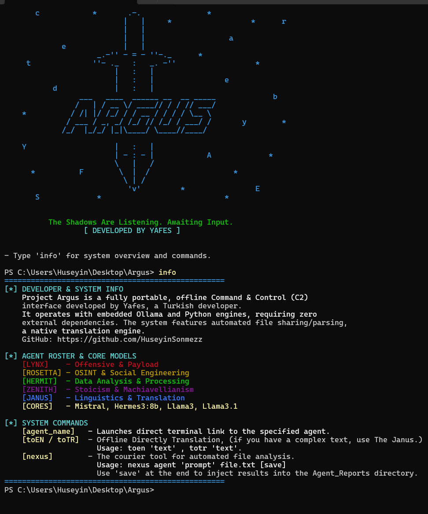

# 👁️ PROJECT ARGUS C2 

**Offline and Portable AI-Powered Command and Control Interface**

Project Argus is a portable intelligence and analysis terminal designed to operate in completely offline (air-gapped) environments. It does not require any cloud API or external connection. It runs directly on your local hardware using its embedded Ollama core and custom-configured Python engines.

## ⚙️ System Architecture
Instead of ordinary chatbots, the system utilizes uncensored and specific "AI Agents" aggressively trained for particular tasks:

* **[LYNX]**: Offensive security, payload analysis, and Red Team operations (Completely Uncensored).
* **[JANUS]**: Uncensored language matrix for complex datasets and professional translation engine.
* **[ROSETTA]**: OSINT and Social Engineering analysis.
* **[HERMIT]**: Raw data processing and log analysis.
* **[ZENITH]**: Strategic oversight, Stoic and Machiavellian analysis (Native Turkish).

## 🚀 Key Features
* **100% Offline Operation:** None of your data leaves the local network. Ensures complete OpSec.
* **Nexus Courier:** A data transport tool that injects plain text (.txt, .log, .csv, .py) files directly into the mind of your selected agent and automatically reports the results.
* **Built-in Translation Engine:** An offline and rapid translation module embedded within the system, utilizing the Argos infrastructure.
* **Portable Structure:** Requires no installation. (See the "Releases" tab for the full version).

## 💻 Hardware and Privacy
The system does not send your data to any cloud servers. Therefore, the agents' text-generation speed, analysis capacity, and the system's overall performance depend 100% on the RAM and GPU (Graphics Card) power of your personal computer.

### [HARDWARE REQUIREMENTS]
* **Minimum System:**
  - **RAM:** 8 GB (DDR4/DDR5)
  - **GPU:** Integrated graphics card or directly via the CPU.
  - **Storage:** At least 20 GB of free space (SSD required).

* **Recommended System (For Operational and Smooth Use):**
  - **RAM:** 16 GB or higher.
  - **GPU:** NVIDIA RTX series (Discrete graphics card with at least 6 GB of VRAM).
  - **Storage:** NVMe M.2 SSD.

> **Note:** Since the system uses the Ollama infrastructure, AI models are loaded into memory (RAM/VRAM). If your system does not have sufficient memory, you will receive an *"Out of Memory"* error or the agents will completely stop responding.

## ⚠️ Installation and Usage
**IMPORTANT NOTE:** Due to hardware limitations, the source codes only contain the C2 Skeleton. 

If you are going to run the system by cloning this repo, you must have **Python 3.x** and **Ollama** installed on your computer. To activate the agents, you must first pull the models into your local engine (e.g., `ollama pull hermes3:8b`).

> Check the **Releases** section on the right for the massive 18 GB "Click and Run" version, which includes all AI brains and the portable Python engine.

## ⌨️ Terminal Usage Examples
The system operates via the command line with a practical syntax:

*Establish a direct terminal connection with the selected agent*
> lynx

*Have the Nexus courier analyze a log file with Hermit (add the "save" command if you want the report saved)*
> nexus hermit "Analyze these server logs and find the anomalies" server_logs.txt save

*Use the built-in translation engine*
> toen "Translate this text to English"
---
*⚖️ Legal Disclaimer*
Project Argus and its included offensive AI modules (e.g., LYNX) have been developed solely for Pentesting, academic research, and cybersecurity education purposes. All legal and penal responsibility arising from the use of this system against unauthorized targets, unauthorized networks, or malicious operations belongs to the end-user. The developer accepts no responsibility.
---
*Developed by Yafes.*

# 👁️ PROJECT ARGUS C2 

**Çevrimdışı ve Taşınabilir Yapay Zeka Destekli Komuta Kontrol Arayüzü**

Project Argus, tamamen çevrimdışı ortamlarda çalışmak üzere tasarlanmış, taşınabilir bir istihbarat ve analiz terminalidir. Herhangi bir bulut API'sine veya dış bağlantıya ihtiyaç duymaz. Kendi içinde barındırdığı Ollama çekirdeği ve özel yapılandırılmış Python motorları ile doğrudan yerel donanımınız üzerinden çalışır.

## ⚙️ Sistem Mimarisi
Sistem, sıradan sohbet botları yerine belirli görevler için agresif bir şekilde eğitilmiş, sansürsüz ve spesifik "Yapay Zeka Ajanları" kullanır:

* **[LYNX]**: Ofansif güvenlik, payload analizi ve Red Team operasyonları (Tamamen Sansürsüz).
* **[JANUS]**: Karmaşık veri setleri için sansürsüz dil matrisi ve profesyonel çeviri motoru.
* **[ROSETTA]**: OSINT ve Sosyal Mühendislik analizleri.
* **[HERMIT]**: Ham veri işleme ve log analizi.
* **[ZENITH]**: Stratejik denetim, Stoik ve Machiavellist analiz (Türkçe Native).

## 🚀 Öne Çıkan Özellikler
* **%100 Çevrimdışı Çalışma:** Hiçbir veriniz internete çıkmaz. Tam OpSec sağlar.
* **Nexus Kuryesi:** Düz metin (.txt, .log, .csv, .py) dosyalarını doğrudan seçtiğiniz ajanın zihnine enjekte eden ve sonuçları otomatik olarak raporlayan veri taşıma aracı.
* **Dahili Çeviri Motoru:** Sistem içine gömülü, Argos altyapısını kullanan çevrimdışı ve hızlı çeviri modülü.
* **Taşınabilir Yapı:** Hiçbir kurulum gerektirmez. (Tam sürüm için "Releases" sekmesine bakınız).

## 💻 Donanım ve Gizlilik
Sistem verilerinizi hiçbir bulut sunucusuna göndermez. Bu nedenle, ajanların metin üretme hızı, analiz kapasitesi ve sistemin genel performansı %100 oranında kişisel bilgisayarınızın RAM ve GPU (Ekran Kartı) gücüne bağlıdır.

### [DONANIM GEREKSİNİMLERİ]
* **Minimum Sistem:**
  - **RAM:** 8 GB (DDR4/DDR5)
  - **GPU:** Dahili grafik kartı veya doğrudan CPU üzerinden.
  - **Depolama:** En az 15 GB boş alan (SSD zorunludur).

* **Önerilen Sistem (Operasyonel ve Akıcı Kullanım İçin):**
  - **RAM:** 16 GB veya üzeri.
  - **GPU:** NVIDIA RTX serisi (En az 6 GB VRAM'e sahip harici ekran kartı).
  - **Depolama:** NVMe M.2 SSD.

> **Not:** Sistem Ollama altyapısını kullandığı için yapay zeka modelleri belleğe (RAM/VRAM) yüklenir. Eğer sisteminizde yeterli bellek yoksa, *"Out of Memory"* hatası alırsınız veya ajanlar yanıt vermeyi tamamen durdurur.

## ⚠️ Kurulum ve Kullanım
**ÖNEMLİ NOT:** kaynak kodlar donanım limitleri gereği sadece C2 İskeletini barındırır. 

Sistemi bu repodan klonlayarak çalıştıracaksanız, bilgisayarınızda **Python 3.x** ve **Ollama** kurulu olmalıdır. Ajanları aktifleştirmek için öncelikle modelleri yerel motorunuza çekmeniz gerekir (örn: `ollama pull hermes3:8b`).

> Tüm yapay zeka beyinlerinin ve taşınabilir Python motorunun içine dahil edildiği "Tıkla ve Çalıştır" 21 GB'lık devasa sürüm için sağ taraftaki **Releases** bölümünü kontrol edin.

## ⌨️ Terminal Kullanım Örnekleri
Sistem komut satırı üzerinden pratik bir sözdizimi ile çalışır:

*Seçilen ajanla doğrudan terminal bağlantısı kurmak*
> lynx

*Nexus kuryesi ile bir log dosyasını Hermit'e analiz ettirmek (rapor kaydedilsin isterseniz "save" komutunu eklemelisiniz)*
> nexus hermit "Bu server loglarını incele ve anomalileri bul" server_logs.txt save

*Dahili çeviri motorunu kullanmak*
> toen "Bu metni İngilizceye çevir"
---
*⚖️ Yasal Uyarı*
Project Argus ve içerdiği ofansif yapay zeka modülleri (örn. LYNX), yalnızca **Pentest, akademik araştırmalar ve siber güvenlik eğitimleri** amacıyla geliştirilmiştir. Bu sistemin yetkisiz hedeflere, izinsiz ağlara veya kötü niyetli operasyonlara karşı kullanılmasından doğacak tüm hukuki ve cezai sorumluluk son kullanıcıya aittir. Geliştirici hiçbir sorumluluk kabul etmez.
---
*Yafes tarafından geliştirilmiştir.*

